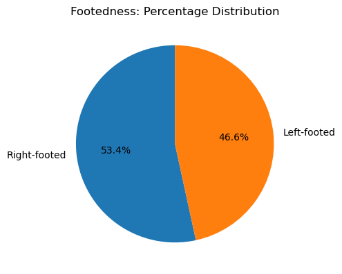
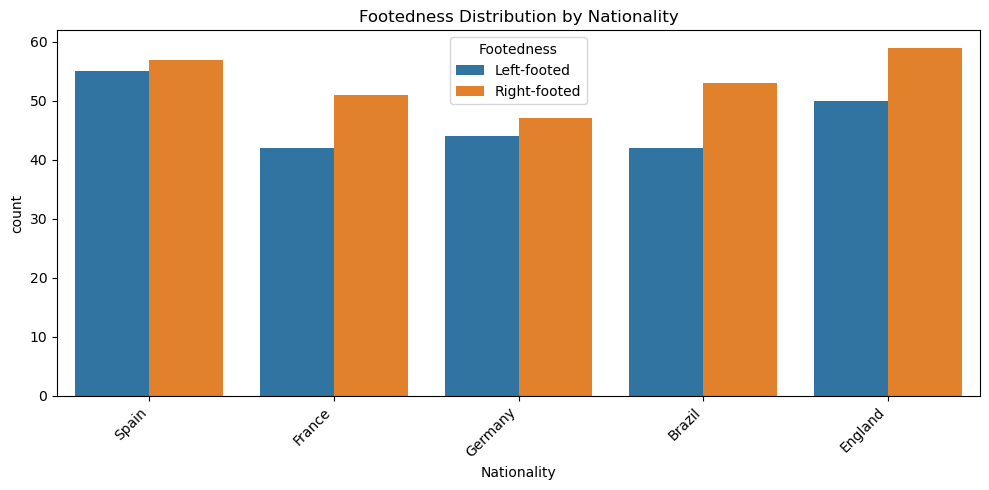
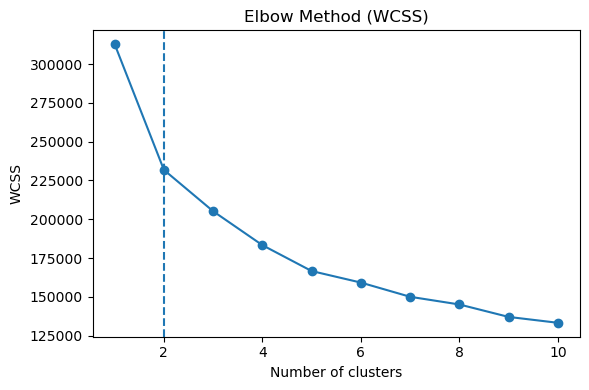

```python
pip install pandas
```

    Requirement already satisfied: pandas in c:\users\hp\anaconda3\lib\site-packages (2.2.2)
    Requirement already satisfied: numpy>=1.26.0 in c:\users\hp\anaconda3\lib\site-packages (from pandas) (1.26.4)
    Requirement already satisfied: python-dateutil>=2.8.2 in c:\users\hp\anaconda3\lib\site-packages (from pandas) (2.9.0.post0)
    Requirement already satisfied: pytz>=2020.1 in c:\users\hp\anaconda3\lib\site-packages (from pandas) (2024.1)
    Requirement already satisfied: tzdata>=2022.7 in c:\users\hp\anaconda3\lib\site-packages (from pandas) (2023.3)
    Requirement already satisfied: six>=1.5 in c:\users\hp\anaconda3\lib\site-packages (from python-dateutil>=2.8.2->pandas) (1.16.0)
    Note: you may need to restart the kernel to use updated packages.
    


```python
pip install numpy
```

    Requirement already satisfied: numpy in c:\users\hp\anaconda3\lib\site-packages (1.26.4)Note: you may need to restart the kernel to use updated packages.
    
    


```python
import pandas as pd
import numpy as np
import matplotlib.pyplot as plt
import seaborn as sns
from sklearn.impute import SimpleImputer
from sklearn.preprocessing import LabelEncoder, StandardScaler
from sklearn.cluster import KMeans
from sklearn.model_selection import train_test_split
from sklearn.linear_model import LogisticRegression
from sklearn.metrics import accuracy_score, confusion_matrix, ConfusionMatrixDisplay
from scipy import stats
import statsmodels.api as sm
from statsmodels.stats.diagnostic import het_breuschpagan
import warnings
warnings.filterwarnings("ignore", category=UserWarning, module="sklearn.cluster._kmeans")
```


```python
data = pd.read_excel('Strikers_performance.xlsx')
data
```


<div>
<style scoped>
    .dataframe tbody tr th:only-of-type {
        vertical-align: middle;
    }

    .dataframe tbody tr th {
        vertical-align: top;
    }

    .dataframe thead th {
        text-align: right;
    }
</style>
<table border="1" class="dataframe">
  <thead>
    <tr style="text-align: right;">
      <th></th>
      <th>Striker_ID</th>
      <th>Nationality</th>
      <th>Footedness</th>
      <th>Marital Status</th>
      <th>Goals Scored</th>
      <th>Assists</th>
      <th>Shots on Target</th>
      <th>Shot Accuracy</th>
      <th>Conversion Rate</th>
      <th>Dribbling Success</th>
      <th>Movement off the Ball</th>
      <th>Hold-up Play</th>
      <th>Aerial Duels Won</th>
      <th>Defensive Contribution</th>
      <th>Big Game Performance</th>
      <th>Consistency</th>
      <th>Penalty Success Rate</th>
      <th>Impact on Team Performance</th>
      <th>Off-field Conduct</th>
    </tr>
  </thead>
  <tbody>
    <tr>
      <th>0</th>
      <td>1</td>
      <td>Spain</td>
      <td>Left-footed</td>
      <td>No</td>
      <td>17.483571</td>
      <td>10.778533</td>
      <td>34.795488</td>
      <td>0.677836</td>
      <td>0.166241</td>
      <td>0.757061</td>
      <td>50.921924</td>
      <td>71.806409</td>
      <td>15.682532</td>
      <td>30.412215</td>
      <td>6.152481</td>
      <td>0.820314</td>
      <td>0.922727</td>
      <td>8.570370</td>
      <td>11.451388</td>
    </tr>
    <tr>
      <th>1</th>
      <td>2</td>
      <td>France</td>
      <td>Left-footed</td>
      <td>Yes</td>
      <td>14.308678</td>
      <td>13.728250</td>
      <td>31.472436</td>
      <td>0.544881</td>
      <td>0.192774</td>
      <td>0.796818</td>
      <td>61.396150</td>
      <td>53.726866</td>
      <td>19.843983</td>
      <td>26.474913</td>
      <td>6.093172</td>
      <td>0.803321</td>
      <td>0.678984</td>
      <td>3.444638</td>
      <td>8.243689</td>
    </tr>
    <tr>
      <th>2</th>
      <td>3</td>
      <td>Germany</td>
      <td>Left-footed</td>
      <td>No</td>
      <td>18.238443</td>
      <td>3.804297</td>
      <td>25.417413</td>
      <td>0.518180</td>
      <td>0.160379</td>
      <td>0.666869</td>
      <td>65.863945</td>
      <td>60.452227</td>
      <td>20.090084</td>
      <td>24.164116</td>
      <td>3.408714</td>
      <td>0.766540</td>
      <td>0.843858</td>
      <td>8.429491</td>
      <td>9.506835</td>
    </tr>
    <tr>
      <th>3</th>
      <td>4</td>
      <td>France</td>
      <td>Right-footed</td>
      <td>No</td>
      <td>22.615149</td>
      <td>9.688908</td>
      <td>20.471443</td>
      <td>0.599663</td>
      <td>0.184602</td>
      <td>0.638776</td>
      <td>88.876877</td>
      <td>60.511979</td>
      <td>22.363152</td>
      <td>44.129989</td>
      <td>6.339820</td>
      <td>0.611798</td>
      <td>0.662997</td>
      <td>6.532552</td>
      <td>8.199653</td>
    </tr>
    <tr>
      <th>4</th>
      <td>5</td>
      <td>France</td>
      <td>Left-footed</td>
      <td>Yes</td>
      <td>13.829233</td>
      <td>6.048072</td>
      <td>29.887563</td>
      <td>0.582982</td>
      <td>0.105319</td>
      <td>0.591485</td>
      <td>75.565531</td>
      <td>54.982158</td>
      <td>13.165708</td>
      <td>37.859323</td>
      <td>8.465658</td>
      <td>0.701638</td>
      <td>0.906538</td>
      <td>8.414915</td>
      <td>6.665333</td>
    </tr>
    <tr>
      <th>...</th>
      <td>...</td>
      <td>...</td>
      <td>...</td>
      <td>...</td>
      <td>...</td>
      <td>...</td>
      <td>...</td>
      <td>...</td>
      <td>...</td>
      <td>...</td>
      <td>...</td>
      <td>...</td>
      <td>...</td>
      <td>...</td>
      <td>...</td>
      <td>...</td>
      <td>...</td>
      <td>...</td>
      <td>...</td>
    </tr>
    <tr>
      <th>495</th>
      <td>496</td>
      <td>England</td>
      <td>Left-footed</td>
      <td>Yes</td>
      <td>17.694550</td>
      <td>7.156699</td>
      <td>39.042650</td>
      <td>0.707015</td>
      <td>0.240660</td>
      <td>0.707748</td>
      <td>89.351540</td>
      <td>60.284576</td>
      <td>28.386885</td>
      <td>39.510350</td>
      <td>4.448635</td>
      <td>0.767147</td>
      <td>0.770213</td>
      <td>5.999478</td>
      <td>12.419711</td>
    </tr>
    <tr>
      <th>496</th>
      <td>497</td>
      <td>Germany</td>
      <td>Right-footed</td>
      <td>Yes</td>
      <td>9.813769</td>
      <td>13.393060</td>
      <td>39.430525</td>
      <td>0.597348</td>
      <td>0.186052</td>
      <td>0.725775</td>
      <td>78.155010</td>
      <td>39.221882</td>
      <td>15.974141</td>
      <td>47.114106</td>
      <td>6.742907</td>
      <td>0.865265</td>
      <td>0.876903</td>
      <td>5.967767</td>
      <td>8.653989</td>
    </tr>
    <tr>
      <th>497</th>
      <td>498</td>
      <td>England</td>
      <td>Left-footed</td>
      <td>Yes</td>
      <td>14.048307</td>
      <td>9.922529</td>
      <td>33.458564</td>
      <td>0.511813</td>
      <td>0.186012</td>
      <td>0.575824</td>
      <td>69.519115</td>
      <td>56.797022</td>
      <td>25.384241</td>
      <td>71.129102</td>
      <td>5.696650</td>
      <td>0.628260</td>
      <td>0.747261</td>
      <td>11.249112</td>
      <td>6.329751</td>
    </tr>
    <tr>
      <th>498</th>
      <td>499</td>
      <td>England</td>
      <td>Right-footed</td>
      <td>Yes</td>
      <td>10.621909</td>
      <td>6.286463</td>
      <td>32.168438</td>
      <td>0.583693</td>
      <td>0.239519</td>
      <td>0.733418</td>
      <td>68.168495</td>
      <td>76.433782</td>
      <td>9.151613</td>
      <td>48.080362</td>
      <td>2.611235</td>
      <td>0.796795</td>
      <td>0.799489</td>
      <td>1.452370</td>
      <td>11.305826</td>
    </tr>
    <tr>
      <th>499</th>
      <td>500</td>
      <td>England</td>
      <td>Left-footed</td>
      <td>No</td>
      <td>8.086001</td>
      <td>9.717748</td>
      <td>29.147689</td>
      <td>0.525510</td>
      <td>0.217003</td>
      <td>0.684474</td>
      <td>66.433269</td>
      <td>63.606479</td>
      <td>14.029053</td>
      <td>31.519344</td>
      <td>10.198942</td>
      <td>0.632972</td>
      <td>0.839876</td>
      <td>6.640761</td>
      <td>12.155555</td>
    </tr>
  </tbody>
</table>
<p>500 rows × 19 columns</p>
</div>


```python
num_cols = data.select_dtypes(include=[np.number]).columns.tolist()
cat_cols = data.select_dtypes(include=["object"]).columns.tolist()

if num_cols:
    data[num_cols] = SimpleImputer(strategy="median").fit_transform(data[num_cols])

if cat_cols:
    data[cat_cols] = SimpleImputer(strategy="most_frequent").fit_transform(data[cat_cols])
```


```python
int_columns = [
    'Goals Scored', 'Assists', 'Shots on Target', 'Movement off the Ball',
    'Hold-up Play', 'Aerial Duels Won', 'Defensive Contribution',
    'Big Game Performance', 'Impact on Team Performance', 'Off-field Conduct'
]
for c in int_columns:
    if c in data.columns:
        data[c] = pd.to_numeric(data[c], errors='coerce').fillna(0).astype(int)
```


```python
print("\n Descriptive Analysis ")
print(data.describe(include="all").round(2))
```

    
     Descriptive Analysis 
            Striker_ID Nationality    Footedness Marital Status  Goals Scored  \
    count       500.00         500           500            500        500.00   
    unique         NaN           5             2              2           NaN   
    top            NaN       Spain  Right-footed            Yes           NaN   
    freq           NaN         112           267            258           NaN   
    mean        250.50         NaN           NaN            NaN         14.52   
    std         144.48         NaN           NaN            NaN          4.91   
    min           1.00         NaN           NaN            NaN          0.00   
    25%         125.75         NaN           NaN            NaN         11.00   
    50%         250.50         NaN           NaN            NaN         15.00   
    75%         375.25         NaN           NaN            NaN         18.00   
    max         500.00         NaN           NaN            NaN         34.00   
    
            Assists  Shots on Target  Shot Accuracy  Conversion Rate  \
    count    500.00           500.00         500.00           500.00   
    unique      NaN              NaN            NaN              NaN   
    top         NaN              NaN            NaN              NaN   
    freq        NaN              NaN            NaN              NaN   
    mean       7.60            25.26           0.60             0.20   
    std        2.96             7.08           0.10             0.05   
    min        0.00             4.00           0.31             0.05   
    25%        6.00            20.00           0.54             0.17   
    50%        8.00            25.00           0.60             0.20   
    75%        9.00            30.00           0.67             0.23   
    max       15.00            43.00           0.92             0.36   
    
            Dribbling Success  Movement off the Ball  Hold-up Play  \
    count              500.00                 500.00        500.00   
    unique                NaN                    NaN           NaN   
    top                   NaN                    NaN           NaN   
    freq                  NaN                    NaN           NaN   
    mean                 0.70                  69.28         59.33   
    std                  0.10                  10.33         10.15   
    min                  0.40                  40.00         35.00   
    25%                  0.64                  62.00         52.00   
    50%                  0.70                  69.00         60.00   
    75%                  0.76                  76.00         66.00   
    max                  1.00                  98.00         92.00   
    
            Aerial Duels Won  Defensive Contribution  Big Game Performance  \
    count             500.00                  500.00                500.00   
    unique               NaN                     NaN                   NaN   
    top                  NaN                     NaN                   NaN   
    freq                 NaN                     NaN                   NaN   
    mean               19.04                   39.47                  6.43   
    std                 4.95                    9.90                  1.98   
    min                 4.00                    8.00                  2.00   
    25%                16.00                   33.00                  5.00   
    50%                19.00                   39.50                  6.00   
    75%                22.00                   46.00                  8.00   
    max                34.00                   71.00                 12.00   
    
            Consistency  Penalty Success Rate  Impact on Team Performance  \
    count        500.00                500.00                      500.00   
    unique          NaN                   NaN                         NaN   
    top             NaN                   NaN                         NaN   
    freq            NaN                   NaN                         NaN   
    mean           0.74                  0.80                        6.52   
    std            0.10                  0.10                        2.11   
    min            0.46                  0.53                        0.00   
    25%            0.68                  0.72                        5.00   
    50%            0.75                  0.80                        6.50   
    75%            0.81                  0.87                        8.00   
    max            1.00                  1.00                       13.00   
    
            Off-field Conduct  
    count              500.00  
    unique                NaN  
    top                   NaN  
    freq                  NaN  
    mean                 7.57  
    std                  2.09  
    min                  0.00  
    25%                  6.00  
    50%                  8.00  
    75%                  9.00  
    max                 13.00  
    


```python
if 'Footedness' in data.columns:
    foot_pct = data['Footedness'].value_counts(normalize=True) * 100
    plt.figure(figsize=(5,5))
    plt.pie(foot_pct.values, labels=foot_pct.index, autopct='%1.1f%%', startangle=90)
    plt.title("Footedness: Percentage Distribution")
    plt.tight_layout()
    plt.show()

if {'Nationality','Footedness'}.issubset(data.columns):
    plt.figure(figsize=(10,5))
    sns.countplot(data=data, x='Nationality', hue='Footedness')
    plt.xticks(rotation=45, ha='right')
    plt.title("Footedness Distribution by Nationality")
    plt.tight_layout()
    plt.show()
```


    

    


    

    


```python
if {'Nationality','Goals Scored'}.issubset(data.columns):
    avg_goals_nat = data.groupby('Nationality')['Goals Scored'].mean().sort_values(ascending=False).round(2)
    print("\nNationality with highest average 'Goals Scored':")
    print(avg_goals_nat.head(1))

if {'Goals Scored','Shots on Target','Footedness'}.issubset(data.columns):
    conv = data.copy()
    conv['Conversion Rate'] = np.where(conv['Shots on Target']>0,
                                       conv['Goals Scored']/conv['Shots on Target'],
                                       np.nan)
    avg_conv_by_foot = conv.groupby('Footedness')['Conversion Rate'].mean().round(2)
    print("\nAverage conversion rate by Footedness (Goals/OnTarget):")
    print(avg_conv_by_foot)

if {'Nationality','Consistency'}.issubset(data.columns):
    groups = [g['Consistency'].dropna() for _, g in data.groupby('Nationality')]
    groups = [g for g in groups if len(g) >= 3]
    if len(groups) >= 2:
        normal_flags = []
        for g in groups:
            g2 = g.sample(n=min(len(g), 5000), random_state=42) if len(g) > 5000 else g
            try:
                _, p_sh = stats.shapiro(g2)
            except Exception:
                p_sh = 0.0
            normal_flags.append(p_sh >= 0.05)
        _, p_lev = stats.levene(*groups, center='median')
        if all(normal_flags) and p_lev >= 0.05:
            F, p_val = stats.f_oneway(*groups)
            print(f"\nANOVA (Consistency by Nationality): F={F:.3f}, p={p_val:.4f}")
        else:
            H, p_val = stats.kruskal(*groups)
            print(f"\nKruskal-Wallis (Consistency by Nationality): H={H:.3f}, p={p_val:.4f}")

if {'Hold-up Play','Consistency'}.issubset(data.columns):
    x = pd.to_numeric(data['Hold-up Play'], errors='coerce')
    y = pd.to_numeric(data['Consistency'], errors='coerce')
    common_idx = x.dropna().index.intersection(y.dropna().index)
    x, y = x.loc[common_idx], y.loc[common_idx]
    def shapiro_ok(s):
        s2 = s.sample(n=min(len(s), 5000), random_state=42) if len(s) > 5000 else s
        try:
            return stats.shapiro(s2)[1] >= 0.05
        except Exception:
            return False
    if shapiro_ok(x) and shapiro_ok(y):
        r, p = stats.pearsonr(x, y)
        print(f"\nPearson correlation: r={r:.3f}, p={p:.4f}")
    else:
        rho, p = stats.spearmanr(x, y)
        print(f"\nSpearman correlation: rho={rho:.3f}, p={p:.4f}")

if {'Hold-up Play','Consistency'}.issubset(data.columns):
    Xreg = sm.add_constant(data['Hold-up Play'])
    yreg = data['Consistency']
    ols = sm.OLS(yreg, Xreg, missing='drop').fit()
    print("\nOLS: Consistency ~ Hold-up Play")
    print(ols.summary())
```

    
    Nationality with highest average 'Goals Scored':
    Nationality
    Brazil    15.32
    Name: Goals Scored, dtype: float64
    
    Average conversion rate by Footedness (Goals/OnTarget):
    Footedness
    Left-footed     0.65
    Right-footed    0.64
    Name: Conversion Rate, dtype: float64
    
    ANOVA (Consistency by Nationality): F=1.528, p=0.1928
    
    Pearson correlation: r=0.147, p=0.0010
    
    OLS: Consistency ~ Hold-up Play
                                OLS Regression Results                            
    ==============================================================================
    Dep. Variable:            Consistency   R-squared:                       0.021
    Model:                            OLS   Adj. R-squared:                  0.020
    Method:                 Least Squares   F-statistic:                     10.93
    Date:                Wed, 13 Aug 2025   Prob (F-statistic):            0.00101
    Time:                        20:00:04   Log-Likelihood:                 429.97
    No. Observations:                 500   AIC:                            -855.9
    Df Residuals:                     498   BIC:                            -847.5
    Df Model:                           1                                         
    Covariance Type:            nonrobust                                         
    ================================================================================
                       coef    std err          t      P>|t|      [0.025      0.975]
    --------------------------------------------------------------------------------
    const            0.6548      0.027     24.031      0.000       0.601       0.708
    Hold-up Play     0.0015      0.000      3.306      0.001       0.001       0.002
    ==============================================================================
    Omnibus:                        1.708   Durbin-Watson:                   2.135
    Prob(Omnibus):                  0.426   Jarque-Bera (JB):                1.744
    Skew:                          -0.100   Prob(JB):                        0.418
    Kurtosis:                       2.791   Cond. No.                         358.
    ==============================================================================
    
    Notes:
    [1] Standard Errors assume that the covariance matrix of the errors is correctly specified.
    


```python
needed = [
    'Goals Scored','Assists','Shots on Target','Dribbling Success',
    'Aerial Duels Won','Defensive Contribution','Big Game Performance','Consistency'
]
if all(c in data.columns for c in needed):
    data['Total Contribution Score'] = (
        data['Goals Scored'] + data['Assists'] + data['Shots on Target'] +
        data['Dribbling Success'] + data['Aerial Duels Won'] +
        data['Defensive Contribution'] + data['Big Game Performance'] + data['Consistency']
    )

le = LabelEncoder()
for col in ['Footedness', 'Marital Status']:
    if col in data.columns:
        data[col] = le.fit_transform(data[col].astype(str))

if 'Nationality' in data.columns:
    data = pd.get_dummies(data, columns=['Nationality'], drop_first=True)
```


```python
drop_id_cols = [c for c in ['Striker_ID','Strikers_ID'] if c in data.columns]
features_for_cluster = data.drop(columns=drop_id_cols, errors='ignore').select_dtypes(include=[np.number]).fillna(0)

wcss = []
for k in range(1, 11):
    km = KMeans(n_clusters=k, random_state=42, n_init='auto')
    km.fit(features_for_cluster)
    wcss.append(km.inertia_)

plt.figure(figsize=(6,4))
plt.plot(range(1,11), wcss, marker='o')
plt.title('Elbow Method (WCSS)')
plt.xlabel('Number of clusters')
plt.ylabel('WCSS')
plt.axvline(2, linestyle='--')
plt.tight_layout()
plt.show()

kmeans = KMeans(n_clusters=2, random_state=42, n_init='auto')
data['Clusters'] = kmeans.fit_predict(features_for_cluster)

if 'Total Contribution Score' in data.columns:
    print("\nAverage Total Contribution Score by Cluster:")
    print(data.groupby('Clusters')['Total Contribution Score'].mean().round(2))

data['Strikers types'] = data['Clusters'].map({0: 'Best strikers', 1: 'Regular strikers'})
data.drop(columns=['Clusters'], inplace=True)
data['Strikers types'] = data['Strikers types'].map({'Best strikers':1, 'Regular strikers':0})
```


    

    


    
    Average Total Contribution Score by Cluster:
    Clusters
    0    101.85
    1    123.35
    Name: Total Contribution Score, dtype: float64
    


```python
target_col = 'Strikers types'
X = data.drop(columns=[target_col] + drop_id_cols, errors='ignore')
y = data[target_col]

scaler = StandardScaler()
X_scaled = scaler.fit_transform(X)

X_train, X_test, y_train, y_test = train_test_split(
    X_scaled, y, test_size=0.20, random_state=42, stratify=y if len(y.unique())>1 else None
)

logreg = LogisticRegression(max_iter=1000)
logreg.fit(X_train, y_train)
y_pred = logreg.predict(X_test)

acc = accuracy_score(y_test, y_pred) * 100
print(f"\nLogistic Regression Accuracy: {acc:.2f}%")

cm = confusion_matrix(y_test, y_pred, labels=[1,0])
disp = ConfusionMatrixDisplay(confusion_matrix=cm, display_labels=['Best','Regular'])
disp.plot()
plt.title("Confusion Matrix — Logistic Regression")
plt.tight_layout()
plt.show()
```

    
    Logistic Regression Accuracy: 97.00%
    


    

    


```python

```
